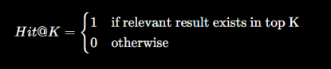

# 🔎 Retrieval Evaluation - Precision@K

# 🔎 Retrieval Evaluation — Precision@K

## 1. What is Retrieval Evaluation?

A RAG system has two important parts:

```
                 RAG
                  │
        ┌─────────┴─────────┐
        ▼                   ▼
   Retrieval             Generation
        │                   │
   Find relevant       Generate answer
   chunks              using chunks
```

**Retrieval evaluation** focuses on the first part:

```
User Question
      ↓
Query Embedding
      ↓
Vector DB
      ↓
Top-K Chunks
      ↓
Are these chunks relevant?
```

We evaluate whether the retrieved chunks are actually useful for answering the query.

---

# 2. Why Retrieval Evaluation Is Important

Suppose your user asks:

> "What is the company's leave policy?"
> 

Your vector database returns:

```
Result 1 → Leave policy          ✅ Relevant
Result 2 → Employee benefits     ✅ Relevant
Result 3 → Company history       ❌ Not relevant
Result 4 → IT security policy    ❌ Not relevant
Result 5 → Salary structure      ❌ Not relevant
```

Your LLM can only work with the context it receives.

If retrieval is bad:

```
Bad Retrieval
     ↓
Wrong Context
     ↓
LLM
     ↓
Poor / incorrect answer
```

So:

> **Good retrieval is a foundation for good RAG.**
> 

---

# 3. What Does @K Mean?

You will frequently see:

```
Precision@1
Precision@3
Precision@5
Precision@10
```

The **K** means:

> **The number of top results retrieved.**
> 

For example:

```
K = 3
```

means:

> Evaluate the top 3 retrieved chunks.
> 

---

# 4. What Is Precision@K?

The formula is:

Precision@K=Number of relevant results in top KKPrecision@K = \frac{\text{Number of relevant results in top K}} {K}

In simple words:

> **Of the first K retrieved results, how many are relevant?**
> 

---

# 5. Simple Example

Suppose we ask:

> "What is Python used for?"
> 

The system retrieves the top 5 chunks:

| Rank | Retrieved Chunk | Relevant? |
| --- | --- | --- |
| 1 | Python is used for data science. | ✅ |
| 2 | Python is used for machine learning. | ✅ |
| 3 | JavaScript is used for web development. | ❌ |
| 4 | Python supports automation. | ✅ |
| 5 | SQL is used for databases. | ❌ |

There are:

```
Relevant = 3
K = 5
```

Therefore:

Precision@5=35Precision@5 = \frac{3}{5}

```
Precision@5 = 0.60
```

or:

```
Precision@5 = 60%
```

---

# 6. Precision@1

Suppose:

```
Top 1 result:
Python is used for data science. ✅
```

Then:

Precision@1=11=1.0Precision@1 = \frac{1}{1} = 1.0

So:

```
Precision@1 = 100%
```

This means the **first retrieved result was relevant**.

---

# 7. Precision@3

Suppose:

```
Top 3:

1. Python → relevant ✅
2. Machine Learning → relevant ✅
3. SQL → irrelevant ❌
```

Then:

Precision@3=23Precision@3 = \frac{2}{3}

```
Precision@3 = 0.667
            = 66.7%
```

---

# 8. Precision@5

Suppose:

```
Top 5:

1. Relevant     ✅
2. Relevant     ✅
3. Irrelevant   ❌
4. Relevant     ✅
5. Irrelevant   ❌
```

Then:

Precision@5=35Precision@5 = \frac{3}{5}

```
Precision@5 = 60%
```

---

# 9. Precision@K Example Visually

Imagine your retriever returns:

```
Query:
"What is Pandas?"

        ↓

Vector Database

        ↓

Top 5 Results

1. Pandas is used for data analysis.       ✅
2. NumPy is used for numerical computing.  ❌
3. Pandas provides DataFrame.              ✅
4. PyTorch is a deep learning framework.   ❌
5. Pandas supports data manipulation.      ✅
```

Relevant:

```
3
```

K:

```
5
```

Therefore:

```
Precision@5 = 3 / 5
            = 0.60
            = 60%
```

---

# 10. Precision@K vs Recall@K

These two are very important.

### Precision@K

Asks:

> **How many of the retrieved documents are relevant?**
> 

### Recall@K

Asks:

> **How many of the relevant documents did we successfully retrieve?**
> 

---

## Example

Suppose there are 4 relevant chunks in the entire database:

```
Relevant chunks:
A
B
C
D
```

Our retriever returns:

```
Top 5:
A ✅
B ✅
X ❌
Y ❌
Z ❌
```

### Precision@5

Relevant retrieved:

```
2
```

Therefore:

Precision@5=25=0.4Precision@5 = \frac{2}{5}=0.4

```
40%
```

### Recall@5

Total relevant chunks:

```
4
```

Retrieved relevant chunks:

```
2
```

Therefore:

Recall@5=24=0.5Recall@5 = \frac{2}{4}=0.5

```
50%
```

So:

```
Precision → How clean are my results?
Recall    → Did I find enough of the relevant information?
```

---

# 11. Precision@K vs Accuracy

Don't confuse these.

### Accuracy

Usually:

Accuracy=Correct predictionsTotal predictionsAccuracy = \frac{Correct\ predictions}{Total\ predictions}

Used for classification/prediction tasks.

### Precision@K

Used for ranked retrieval:

```
Query
 ↓
Ranked results
 ↓
Top K
 ↓
Relevant / Not relevant
```

For your **RAG retrieval evaluation**, Precision@K is much more appropriate.

---

# 12. What Is a Ground Truth?

In **RAG (Retrieval-Augmented Generation)**, **Ground Truth** means the **correct/reference answer or information that we already know is true**, which we use to evaluate whether the RAG system retrieved the right information and generated the right answer.

### Simple example

Suppose your company has this document:

> "Employees are eligible for 20 days of paid vacation per year."
> 

User asks:

> **"How many vacation days do employees get?"**
> 

The **ground truth** is:

> **20 days**
> 

Your RAG system might:

1. **Retrieve** a chunk saying "Employees are eligible for 20 days..."
2. **Generate**: "Employees get 20 paid vacation days per year."
3. Compare the generated answer with the **ground truth**.

### Ground truth in RAG evaluation

It can be used to evaluate different parts of the RAG pipeline:

| Component | What ground truth helps evaluate |
| --- | --- |
| **Retrieval** | Did we retrieve the correct document/chunk? |
| **Answer generation** | Did the LLM give the correct answer? |
| **Faithfulness** | Is the answer supported by the retrieved context? |
| **Answer relevance** | Does the answer actually address the question? |

For example, you might have an evaluation dataset like:

```
Question:
"What is the company's vacation policy?"

Ground-truth answer:
"Employees receive 20 days of paid vacation per year."

Relevant document:
"HR_Policy_2026.pdf, page 12"
```

Then you run your RAG system and get:

```
Retrieved context:
"Employees receive 20 days of paid vacation..."

Generated answer:
"Employees receive 20 paid vacation days annually."
```

The generated answer is essentially equivalent to the ground truth → **good result**.

### One important distinction

**Ground truth ≠ retrieved context.**

- **Ground truth** = what the correct answer *should be*
- **Retrieved context** = what the RAG system *found*
- **Generated answer** = what the LLM *said*

A useful way to visualize it:

```
                 RAG SYSTEM
                    │
Question ────────► Retrieval ─────► Context ─────► LLM
                    │                              │
                    │                              ▼
                    │                         Generated Answer
                    │                              │
                    └──────► Compare with ◄────────┘
                               Ground Truth
```

In RAG benchmarking, a dataset often contains **questions + ground-truth answers + relevant documents**, allowing you to measure how well the whole RAG pipeline performs.

---

# 13. Creating an Evaluation Dataset

For a real RAG project, create a dataset like:

| Query | Relevant Chunk IDs |
| --- | --- |
| What is Python? | 0, 1 |
| What is machine learning? | 2 |
| What is Pandas? | 3 |
| What is NumPy? | 4 |
| What is PyTorch? | 5 |
| What is computer vision? | 6 |
| What is NLP? | 7 |

This becomes your **retrieval evaluation dataset**.

---

# 14. Mean Precision@K

When we have multiple queries, we calculate the average.

This is often called:

> **Mean Precision@K**
> 

For example:

```
Query 1 → 0.80
Query 2 → 0.60
Query 3 → 1.00
Query 4 → 0.40
```

Then:

Mean Precision@K=0.8+0.6+1.0+0.44Mean\ Precision@K = \frac{0.8+0.6+1.0+0.4}{4}

```
= 0.70
```

Therefore:

```
Mean Precision@K = 70%
```

This gives us one overall retrieval-quality number.

---

# 15. Important Retrieval Metrics

For your internship scope, don't learn only Precision@K.

You should understand these:

| Metric | What it measures |
| --- | --- |
| Precision@K | How many top-K results are relevant |
| Recall@K | How many relevant items were retrieved |
| Hit Rate@K | Whether at least one relevant item appears in top-K |
| MRR | How high the first relevant result appears |
| MAP | Average precision across multiple relevant results |
| NDCG@K | Ranking quality while considering relevance position |

---

# 16. Hit Rate@K

Example:

```
Top 5:

A ❌
B ❌
C ❌
D ✅
E ❌
```

At least one relevant result exists.

Therefore:

```
Hit@5 = 1
```

If there is no relevant result:

```
A ❌
B ❌
C ❌
D ❌
E ❌

Hit@5 = 0
```

Formula:



---

# 17. MRR — Mean Reciprocal Rank

MRR cares about **where the first relevant result appears**.

Suppose:

```
Rank 1 → ❌
Rank 2 → ❌
Rank 3 → ✅
```

Then:

$$
RR=13RR = \frac{1}{3}
$$

```
RR = 0.333
```

If the first result is relevant:

```
Rank 1 → ✅
```

Then:

RR=1RR = 1

MRR is the average reciprocal rank across queries.

### Why useful?

If your RAG system usually puts the correct chunk at rank 1, MRR will be high.

---

# 18. NDCG@K

**NDCG = Normalized Discounted Cumulative Gain**

This is useful when relevance isn't simply:

```
Relevant / Not Relevant
```

but has levels:

```
3 → Highly relevant
2 → Relevant
1 → Slightly relevant
0 → Irrelevant
```

Example:

```
Rank 1 → 3
Rank 2 → 2
Rank 3 → 0
Rank 4 → 1
```

NDCG rewards highly relevant documents appearing near the top.

---

# 19. Retrieval Evaluation in RAG

Now connect everything you've learned.

You have:

### Chunking

```
Document
 ↓
Chunks
```

### Embeddings

```
Chunks
 ↓
Vectors
```

### Vector DB

```
Vectors
 ↓
FAISS / Pinecone / Weaviate
```

### Retrieval

```
Query
 ↓
Similarity Search
 ↓
Top-K chunks
```

### Evaluation

```
Top-K chunks
      ↓
Compare against
ground truth
      ↓
Precision@K
Recall@K
MRR
Hit Rate
```

So your complete learning pipeline is:

```
                 DOCUMENT
                    ↓
                 CHUNKING
                    ↓
                EMBEDDINGS
                    ↓
                VECTOR DB
                    ↓
                 RETRIEVAL
                    ↓
              ┌─────┴─────┐
              ↓           ↓
        Retrieved      Ground Truth
         Chunks
              ↓           ↓
              └─────┬─────┘
                    ↓
            RETRIEVAL EVALUATION
                    ↓
        ┌───────────┼───────────┐
        ↓           ↓           ↓
   Precision@K   Recall@K      MRR
```

---

# 20. Very Important: Retrieval vs Generation Evaluation

### Retrieval Evaluation

Question:

> Did we retrieve the right information?
> 

Metrics:

```
Precision@K
Recall@K
Hit Rate@K
MRR
NDCG
```

### Generation Evaluation

Question:

> Did the LLM generate a good answer using the retrieved information?
> 

Metrics can include:

```
Answer correctness
Faithfulness
Relevance
Completeness
Groundedness
```

Therefore:

```
RAG Evaluation
│
├── Retrieval Evaluation
│   ├── Precision@K
│   ├── Recall@K
│   ├── Hit Rate@K
│   ├── MRR
│   └── NDCG
│
└── Generation Evaluation
    ├── Correctness
    ├── Faithfulness
    ├── Relevance
    └── Groundedness
```

---

# 21. How Chunking Affects Retrieval Evaluation

This connects directly to your **previous topic**.

Suppose you test:

```
Chunk size = 100
Overlap = 10
```

Results:

```
Precision@5 = 0.55
```

Then:

```
Chunk size = 300
Overlap = 50
```

Results:

```
Precision@5 = 0.72
```

Then:

```
Chunk size = 500
Overlap = 75
```

Results:

```
Precision@5 = 0.68
```

Your experiment tells you:

```
100/10 → 55%
300/50 → 72% ⭐
500/75 → 68%
```

Therefore, for this dataset:

> **300 chunks + 50 overlap performed best based on Precision@5.**
> 

This is how you should actually optimize your RAG pipeline rather than choosing chunk sizes randomly.

---